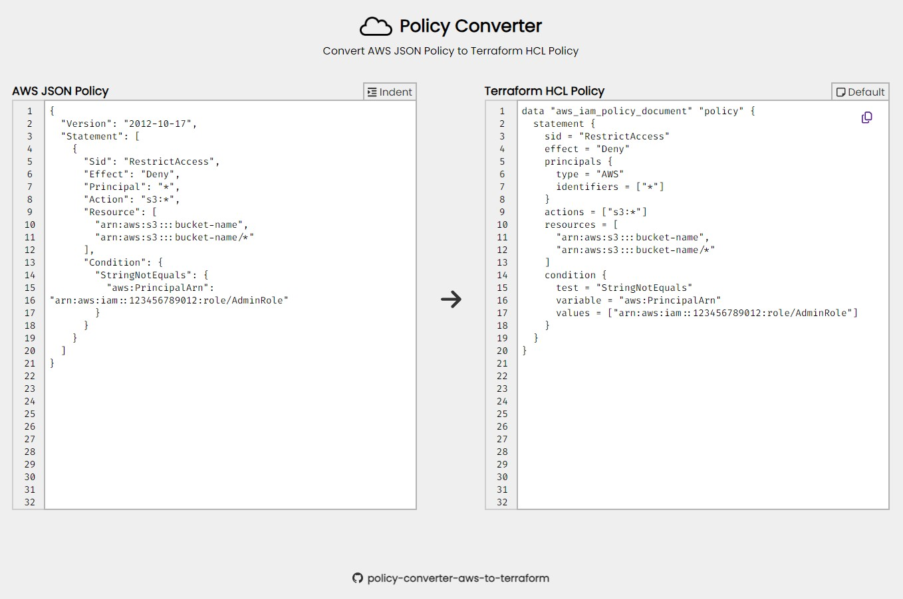

<h1 align="center">Policy Converter</h1>

A web tool to convert AWS policies from JSON format to Terraform HCL data source code [`aws_iam_policy_document`](https://registry.terraform.io/providers/hashicorp/aws/latest/docs/data-sources/iam_policy_document)

<a target="_blank" rel="noopener" title="policy-converter-aws-to-terraform" href="https://almeida-matheus.github.io/policy-converter-aws-to-terraform">
    <h4 align="center">Access the Project</h4>
</a>

Features
- AWS Policy validator
- JSON validator
- JSON formatter
- Convert AWS JSON Policy to Terraform HCL
    - Identity Based Policy
    - Resource Based Policy